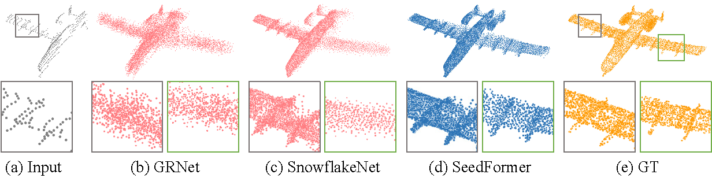

# SeedFormer: Patch Seeds based Point Cloud Completion with Upsample Transformer



This repository contains PyTorch implementation for **SeedFormer: Patch Seeds based Point Cloud Completion with Upsample Transformer** (ECCV 2022).

SeedFormer presents a novel method for *Point Cloud Completion*. In this work, we introduce a new representation, namely **Patch Seeds**, which not only captures general structures from partial inputs but also preserves distinctive information of local patterns. Moreover, we devise a novel **Upsample Transformer** by extending the transformer structure into basic operations of generating points, which explicitly incorporates spatial and semantic relationships in the local neighborhood. 


## 🔥Updates
* 2022-07-05: Initial Update.

## Installation

The code has been tested on one configuration:

- python == 3.6.8
- PyTorch == 1.8.1
- CUDA == 10.2
- numpy
- open3d

```
pip install -r requirements.txt
```

Compile the C++ extension modules:

    sh install.sh

## Datasets

Download dataset files from [here](https://drive.google.com/drive/folders/1SJIbQATMMbq3UIWzl0YX43KDZz8t6OlG?usp=sharing).

The details of used datasets can be found in [DATASET.md](./DATASET.md) (thank the authors of PoinTr).


## Usage

### Training on PCN dataset

First, you should specify your dataset directories in `train_pcn.py`:

    __C.DATASETS.SHAPENET.PARTIAL_POINTS_PATH        = '<*PATH-TO-YOUR-DATASET*>/PCN/%s/partial/%s/%s/%02d.pcd'
    __C.DATASETS.SHAPENET.COMPLETE_POINTS_PATH       = '<*PATH-TO-YOUR-DATASET*>/PCN/%s/complete/%s/%s.pcd'

SeedFormer takes two V100 gpus with a batch size of 48. To train SeedFormer on PCN dataset, simply run:

    python3 train_pcn.py

### Testing on PCN dataset

To test a pretrained model, run:

    python3 train_pcn.py --test

Or you can give the model directory name to test one particular model:

    python3 train_pcn.py --test --pretrained train_pcn_Log_2022_XX_XX_XX_XX_XX

Save generated complete point clouds as well as gt and partial clouds in testing:

    python3 train_pcn.py --test --output 1


## Acknowledgement

Some parts of the code are borrowed from [GRNet](https://github.com/hzxie/GRNet) and [SnowflakeNet](https://github.com/AllenXiangX/SnowflakeNet). We thank the authors for their excellent work.
